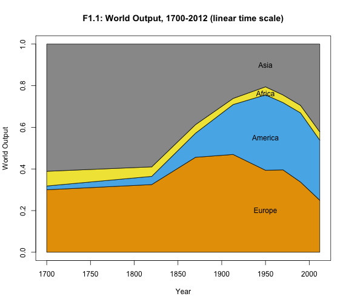
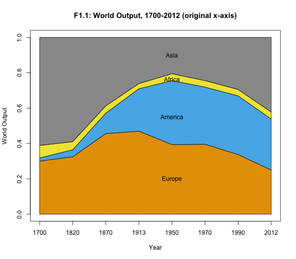
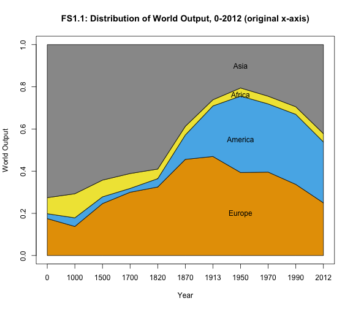

Capital in the 21st Century: Chapter 1
========================================================

### Data provenance

The data were downloaded as Excel files from: http://piketty.pse.ens.fr/en/capital21c2. 

### Loading relevant libraries and data

This document depends on the [xlsx](http://cran.r-project.org/web/packages/xlsx/index.html) package.


```r
library(xlsx)

fig1s1_dat = read.xlsx(
    "./Piketty2014FiguresTables/Chapter1TablesFigures.xlsx", 
    sheetName="TS1.1a", rowIndex=7:18, colIndex=c(1,3:6), header=TRUE)
names(fig1s1_dat)[1] = "Year" 
fig1s1_dat$EAm = fig1s1_dat$Europe+fig1s1_dat$America
fig1s1_dat$EAmAf = fig1s1_dat$EAm+fig1s1_dat$Africa
```


## Figure F1.1

This code remakes Figure F1.1, scaling time on the x-axis linearly:


```r
plotdat = subset(fig1s1_dat, Year>=1700) #take out years before 1700
cbPalette <- c("#999999", "#E69F00", "#56B4E9", "#009E73", "#F0E442", 
    "#0072B2", "#D55E00", "#CC79A7") #ggplot2 recommended colorblind palette
plot(plotdat$Year, rep(0, nrow(plotdat)), 
    type='n', ylim=c(0,1), xlab="Year", ylab='World Output')
yearRevYear = c(plotdat$Year, rev(plotdat$Year))
polygon(x=yearRevYear, y=c(rep(0, nrow(plotdat)), rev(plotdat$Europe)), col=cbPalette[2])
polygon(x=yearRevYear, y=c(plotdat$Europe, rev(plotdat$EAm)), col=cbPalette[3])
polygon(x=yearRevYear, y=c(plotdat$EAm, rev(plotdat$EAmAf)), col=cbPalette[5])
polygon(x=yearRevYear, y=c(plotdat$EAmAf, rep(1, nrow(plotdat))), col=cbPalette[1])
text(1950, 0.9, 'Asia')
text(1950, 0.764, 'Africa')
text(1950, 0.55, 'America')
text(1950, 0.2, 'Europe')
title("World Output, 1700-2012 (linear time scale)")
```

 

This code remakes Figure F1.1 as it appears in the original analysis: data points on the x-axis are equally spaced, no matter how far apart in time they are:


```r
plot(1:8, rep(0,8), type='n', xaxt='n', ylim=c(0,1), xlab="Year", 
    ylab='World Output')
axis(side=1, at=1:8, labels=plotdat$Year)
xcoords = c(1:8, 8:1)
polygon(x=xcoords, y=c(rep(0,8), rev(plotdat$Europe)), col=cbPalette[2])
polygon(x=xcoords, y=c(plotdat$Europe, rev(plotdat$EAm)), col=cbPalette[3])
polygon(x=xcoords, y=c(plotdat$EAm, rev(plotdat$EAmAf)), col=cbPalette[5])
polygon(x=xcoords, y=c(plotdat$EAmAf, rep(1,8)), col=cbPalette[1])
text(5, 0.9, 'Asia')
text(5, 0.764, 'Africa')
text(5, 0.55, 'America')
text(5, 0.2, 'Europe')
title("World Output, 1700-2012 (original x-axis)")
```

 

## Figure S1.1

This code remakes Figure S1.1, scaling time on the x-axis linearly:


```r
cbPalette <- c("#999999", "#E69F00", "#56B4E9", "#009E73", "#F0E442", "#0072B2", "#D55E00", "#CC79A7")
plot(fig1s1_dat$Year, rep(0,nrow(fig1s1_dat)), 
    type='n', ylim=c(0,1), xlab="Year", ylab='World Output')
yearRevYear = c(fig1s1_dat$Year, rev(fig1s1_dat$Year))
polygon(x=yearRevYear, y=c(rep(0,nrow(fig1s1_dat)), rev(fig1s1_dat$Europe)), col=cbPalette[2])
polygon(x=yearRevYear, y=c(fig1s1_dat$Europe, rev(fig1s1_dat$EAm)), col=cbPalette[3])
polygon(x=yearRevYear, y=c(fig1s1_dat$EAm, rev(fig1s1_dat$EAmAf)), col=cbPalette[5])
polygon(x=yearRevYear, y=c(fig1s1_dat$EAmAf, rep(1, nrow(fig1s1_dat))), col=cbPalette[1])
text(1950, 0.9, 'Asia')
text(1950, 0.764, 'Africa')
text(1950, 0.55, 'America')
text(1950, 0.2, 'Europe')
title("Distribution of World Output, 0-2012 (linear time scale)")
```

 

And this code remakes Figure S1.1, scaling time as it was scaled in the original figure:


```r
plot(1:11, rep(0,11), type='n', xaxt='n', ylim=c(0,1), xlab="Year", 
    ylab='World Output')
axis(side=1, at=1:11, labels=fig1s1_dat$Year)
xcoords = c(1:11, 11:1)
polygon(x=xcoords, y=c(rep(0,11), rev(fig1s1_dat$Europe)), col=cbPalette[2])
polygon(x=xcoords, y=c(fig1s1_dat$Europe, rev(fig1s1_dat$EAm)), col=cbPalette[3])
polygon(x=xcoords, y=c(fig1s1_dat$EAm, rev(fig1s1_dat$EAmAf)), col=cbPalette[5])
polygon(x=xcoords, y=c(fig1s1_dat$EAmAf, rep(1,11)), col=cbPalette[1])
text(8, 0.9, 'Asia')
text(8, 0.764, 'Africa')
text(8, 0.55, 'America')
text(8, 0.2, 'Europe')
title("Distribution of World Output, 0-2012 (original x-axis)")
```

 


